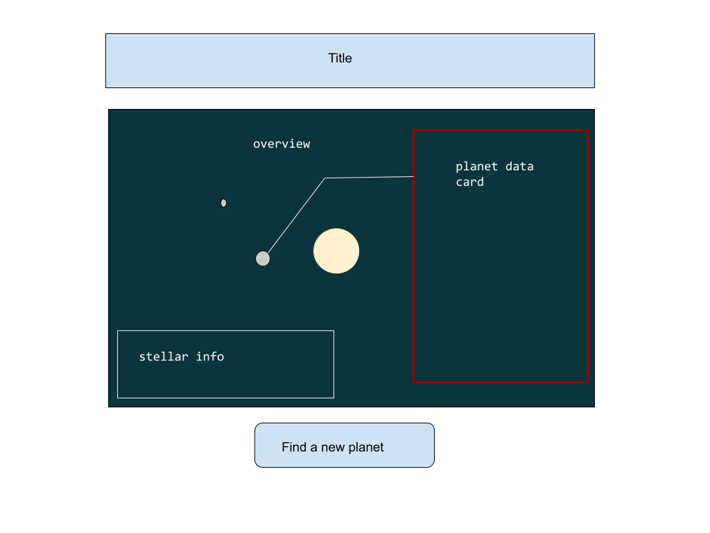

# exoplanet-explorer

# Background:

This project aims to display known information about a random exoplanetary system obtained from the NASA Exoplanetary Archive. On initialization, there will be a zone with nothing rendered until the user presses the button to find a random star system with planets. Then the render zone will show the star with its planets orbiting around it. The initial frame shows information about the star (radius, mass, temperature, classification, etc). Hovering over a planet pauses the animation and clicking on it will bring up a data card for that planet . The user may click on the find a new planet button at any time to cease rendering and re-render with that new exoplanetary system’s data. 

Visually, data will be presented using canvas 2d animation. The aesthetic theme is minimalist and futuristic.

# Functionality and MVPs:
In Exoplanet Explorer, users will be able to:

- Hovering over a planet pauses the animation and clicking on it will bring up a data card for that planet 
- Clicking on the star brings up a data card for that star.
- A button generates a new star system 
- Shows a star with its planets orbiting around it.

In addition, this project will include:

- A modal with a map of HUD elements
- This readme.

# Wireframe:

- Title: contains information about the app
- Overview: contains the main canvas (perhaps the only canvas) Here, the star will be at a fixed location in the center of the frame, and the planets will be orbiting along the x axis (for ease). Each planet will be clickable and will pause animation, bringing up its data card.
- Stellar info - a hidden display toggled on/off by clicking on the star. 
- Planetary info - a hidden display that renders upon clicking the planet. 
- Find a new planet button - click this to fetch a new exoplanet, clear the current canvas and re-render. 

# Technologies, Libraries, and APIs:
- Canvas
- Still trying to research what libraries I can use to portray the movement of the planets
- NASA’s Exoplanet Archive TAP service (I don’t really understand how the TAP service works as an API, but acts on the archive using SQL-like syntax, though it is limited and very verbose, but hypothetically can still be used to fetch data)
- webpack
- npm

# Implementation Timeline:
### Thursday & Friday:
- Set up HTML skeleton and implement classes for Star and Planet - identify specific data needed to implement movement, and data for display.
- Query logistics - test requests to TAP service and work out those problems.
### Saturday & Sunday:
- Start logic for movement of planets (crash course in physics)
- Start implementing event handlers & data displays
### Monday 
- Continue planetary movement - if successful, move on
- Continue/finish event handlers & data displays
### Tuesday
- Make any optimizations as necessary
### Wednesday
- CSS styling. 
### Thursday
- D-Day.

# Bonuses:
- Display habitability index and corresponding color to planets that are classified.
- Improve orbital mechanics - utilize different libraries for better and more accurate visualizations of orbit, think 3D click/drag map.
- Use coordinates to find nearby star systems with alerts for habitable planets
